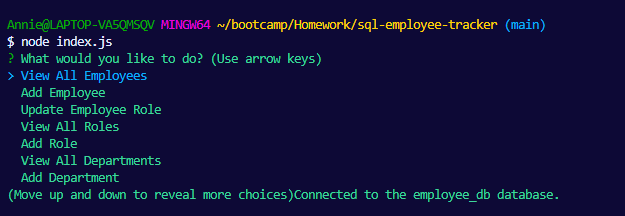

# README Generator
  

  ## Description

This application is creating a employee database using MySQL and allows user input with inquirer to update the the employee database by allowing to view all for departments, roles, and employee tables along with being able to add a department, role, and employee and update employee role.

  ## Table of Contents
  - [Installation](#installation)
  - [Usage](#usage)
  - [License](#license)
  - [Questions](#questions)

  ## Installation

Git clone the repository into your local remote.

Please make sure that all required dependencies has been downloaded. If not, please run the following command:

`npm i`

This will download the npm packages [Inquirier](https://www.npmjs.com/package/inquirer), [MySQL](https://www.npmjs.com/package/mysql), and [dotenv](https://www.npmjs.com/package/dotenv).

  ## Usage

After cloning the repository, open the repository in terminal and run the below command:

`node index.js`

This will provide prompted questions:
1. View employees, roles, or departments will show a table of current data.
2. Add employee, role, or department will prompt further questions to add into database whichever option selected.
3. When finished, select "Exit" to leave the prompt.

Feel free to check out recording below to understand how it works: [Recording of Application](https://drive.google.com/file/d/1QSktSt9-P-Amp-hY1-rtHrc-3leGebLp/view)

Future methods to be added: Delete options to delete employee, roles, and departments. 

  ## License

This project is licensed under MIT. Please check LICENSE document in repository for more information.

  ## How to Contribute

If you would like to contribute to this project, please open a new issue or submit a pull request.

  ## Tests

There are currently no test for this application.

  ## Questions

  If you have any questions, feel free to reach me at [GitHub](https://github.com/Annie-McElroy) or via email at [annie.mcelroy8522@gmail.com](annie.mcelroy8522@gmail.com).